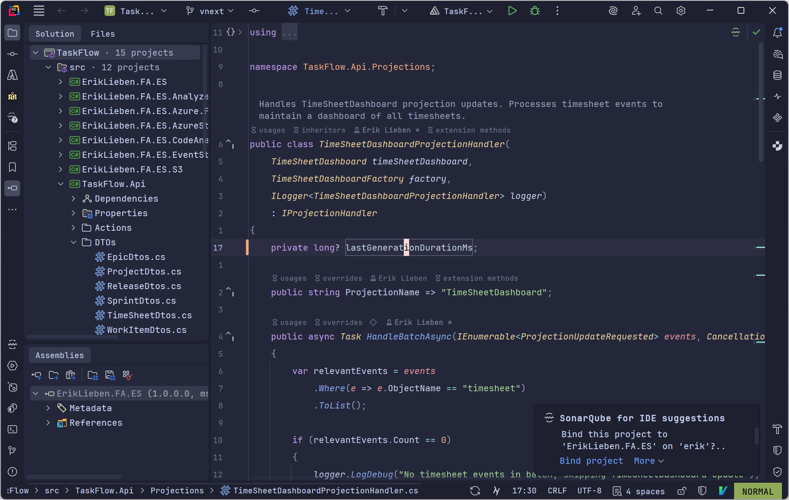
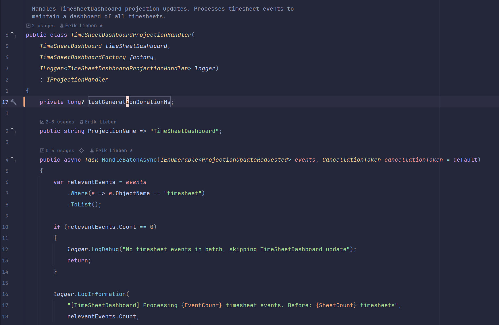
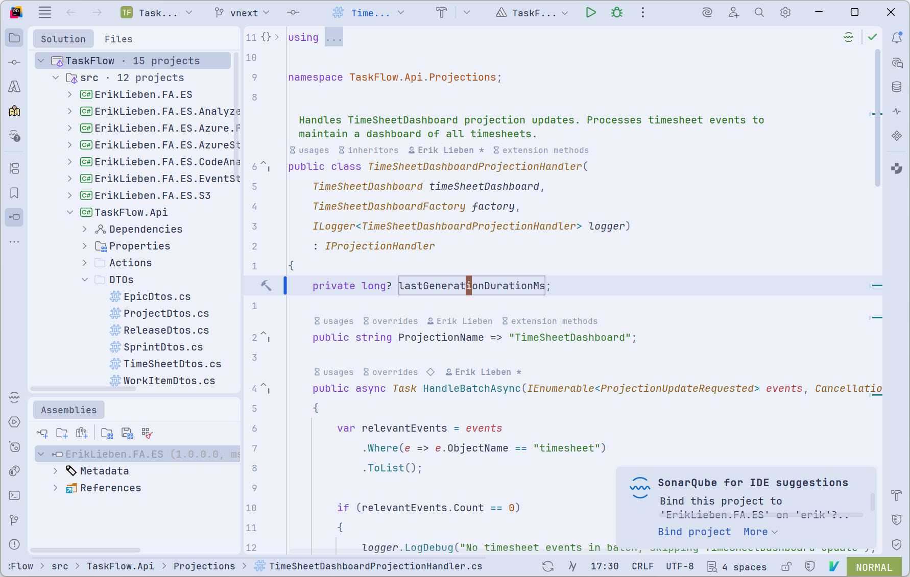
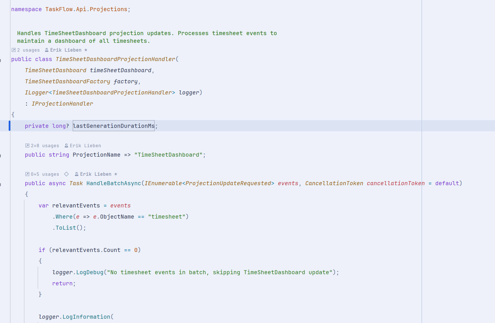

# Erik's Theme

A personal theme for JetBrains IDEs, inspired by [Catppuccin](https://github.com/catppuccin/jetbrains).

## Variants

- **Erik's theme (light)** - A warm, blue-tinted light theme, initially based on Catppuccin Latte
- **Erik's theme (dark)** - A comfortable dark theme based on Catppuccin Macchiato colors

Both variants target the **Islands** UI (JetBrains 2024.2+).

> **Note:** This is a personal theme that will be adjusted to my preferences over time. If you prefer the original Catppuccin colors, check out the [official Catppuccin theme](https://github.com/catppuccin/jetbrains).

### Dark




### Light




## Installation

### From the JetBrains Marketplace

1. Go to **Settings** > **Plugins** > **Marketplace**
2. Search for **Erik's Theme**
3. Click **Install** and restart your IDE

### From source

```bash
./gradlew buildPlugin
```

Then install the resulting ZIP from `build/distributions/` via **Settings** > **Plugins** > **Install Plugin from Disk**.

## Usage

1. Go to **Settings** > **Appearance & Behaviour** > **Appearance**
2. Select **Erik's theme (light)** or **Erik's theme (dark)**
3. (Optional) Restart your IDE

## License

MIT - See [LICENSE](LICENSE) for details. Inspired by the [Catppuccin](https://github.com/catppuccin/jetbrains) theme.
